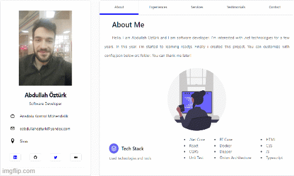

<p align="center" class="mb-2">
<br> A simple, delicate and modern template for who anyone need portfolio!
<br>|
<a href="https://react-dev-portfolio-ao.vercel.app"> Preview</a> |
<a href="https://github.com/AbdullahOztuurkk/react-dev-portfolio/wiki">Documentation</a> |
<br>
</p>

<p align="center">
	</img>
</p>


## 🔹 Installation

```bash 
$ git clone https://github.com/AbdullahOztuurkk/react-dev-portfolio devportfolio
$ cd devportfolio
$ npm install
$ npm run start
```
## 🔨 Development
This project is built with

- React-router-dom
- Tailwind CSS
- React-icons
- Context API


## 🎉 Contribute
If you feel like to help us build a better portfolio, you can

🛑 [Report a bug](https://github.com/AbdullahOztuurkk/react-dev-portfolio/issues)
🛠 [Suggest a new feature](https://github.com/AbdullahOztuurkk/react-dev-portfolio/pulls)


## 📑 License

This project is licensed under the MIT License - see the [LICENSE](https://github.com/AbdullahOztuurkk/react-dev-portfolio/blob/master/LICENSE) file for details.
